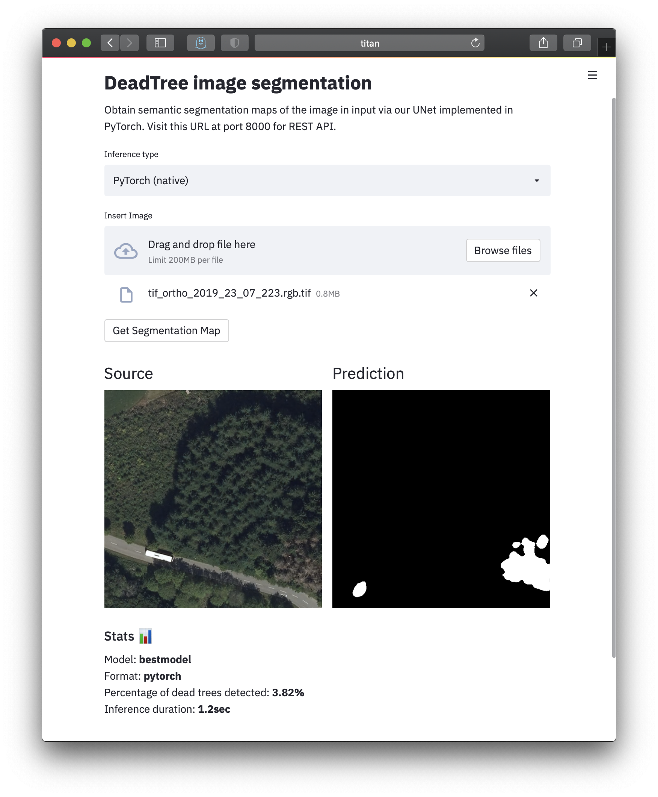

<div align="center">

# DeadTrees

<a href="https://pytorch.org/get-started/locally/"></a>
<a href="https://pytorchlightning.ai/"></a>
<a href="https://hydra.cc/"></a>
<a href="https://fastapi.tiangolo.com/"></a>
<a href="https://streamlit.io"></a>

<br>

</div>

## Description
Map dead trees from ortho photos. A Unet (semantic segmentation model) is trained on a ortho photo collection of Luxembourg (year: 2019). This repository contains the preprocessing pipeline, training scripts, models, and a docker-based demo app (backend: FastAPI, frontend: Streamlit).

<p align="center">
   
   Fig 1: Streamlit UI for interactive prediction of dead trees in ortho photos.
</p>


## How to run

```yaml
# clone project
git clone https://github.com/cwerner/deadtrees
cd deadtrees

# [OPTIONAL] create virtual environment (using venve, pyenv, etc.) 
# and activate it

# install requirements (basic requirements):
pip install -e . 

# [OPTIONAL] install extra requirements for training:
pip install -e ".[train]"

# [OPTIONAL] install extra requirements to preprocess the raw data
# (instead of reading preprocessed data from S3):
pip install -e ".[preprocess]"

# [ALTERNATIVE] install all subpackages:
pip install -e ".[all]"
```

Train model with default configuration:
```yaml
cd scripts
python train.py
```

<br>
